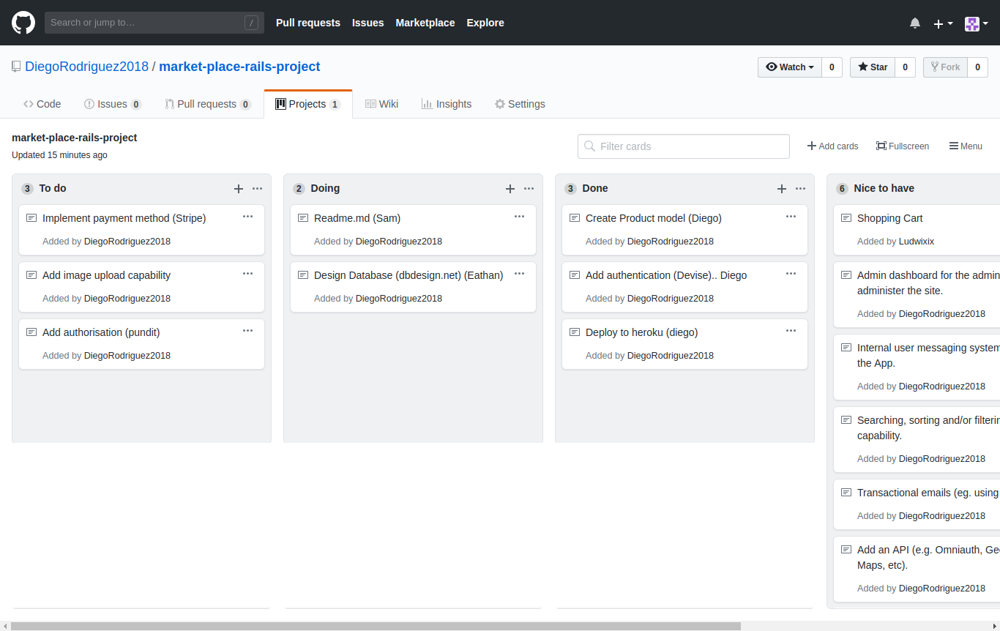

# README

## Website URL
```Insert Published URL link```

### Github Repository
```Insert GitHub Repository Link```

## Project Description


##### | Problems Encountered |
```

define problems

```
##### | Purpose |
```

website purpose

```
#####  | Functionality |
```

website Functionality

```
##### | features |
```

website features

```
##### | Screenshots |
```

INSERT Screenshots

```
#### | Tech Stack |
```

(e.g. html, css, deployment platform, etc)

```
#### | Setup & Configuration Instructions|
```

    Instructions on how to setup, configure and use your App.

```
## Design Documentation
```
Design process
User stories
A workflow diagram of the user journey/s.
Wireframes
Database Entity Relationship Diagrams
```
## Details of planning process
```
including,
Project plan & timeline
Screenshots of Trello board(s)
```

"Day 1 GutHub Projects Board"


___________________________________________________
# Answers to the 24 Questions


#### 1. What is the need (i.e. challenge) that you will be addressing in your project?

* To build a marketplace where users can buy, sell, trade camouflage patterns, clothing and related products.
* The website will also provide a database on various camouflage related history and patterns.

#### 2. Identify the problem you’re trying to solve by building this particular marketplace App? Why is it a problem that needs solving?

* Currently no purely camouflage orientated marketplace exists.

#### 3. Describe the project you will be conducting and how your App will address these needs.

* We will be building a two sided marketplace that offers a location for users to buy, sell and trade camouflage clothing and items. It will also provide users with information pertaining to all aspects of DPM.

#### 4. Describe the network infrastructure the App may be based on.
#### 5. Identify nd describe the software to be used in your App.
#### 6. Identify the database to be used in your App and provide a justification for your choice.
#### 7. Identify and describe the production database setup (i.e. postgres instance).
#### 8. Describe the architecture of your App.
#### 9. Explain the different high-level components (abstractions) in your App.
#### 10. Detail any third party services that your App will use.
#### 11. Describe (in general terms) the data structure of marketplace apps that are similar to your own (e.g. eBay,   Airbnb).
#### 12. Discuss the database relations to be implemented.
#### 13. Describe your project’s models in terms of the relationships (active record associations) they have with each other.
#### 14. Provide your database schema design.
#### 15. Provide User stories for your App.
#### 16. Provide Wireframes for your App.
#### 17. Describe the way tasks are allocated and tracked in your project.
#### 18. Discuss how Agile methodology is being implemented in your project.
#### 19. Provide an overview and description of your Source control process.
#### 20. Provide an overview and description of your Testing process.
#### 21. Discuss and analyse requirements related to information system security.
#### 22. Discuss methods you will use to protect information and data.
#### 23. Research what your legal obligations are in relation to handling user data.
