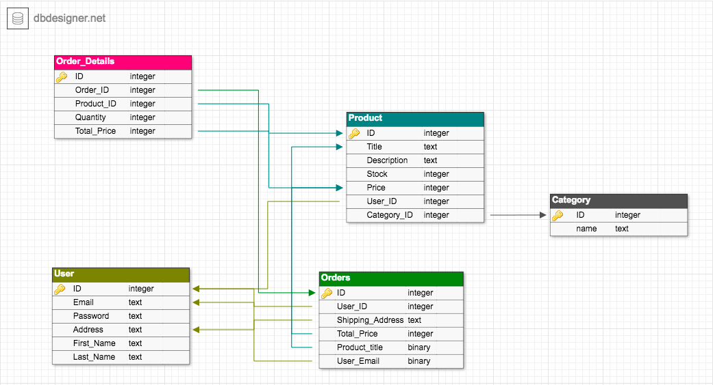
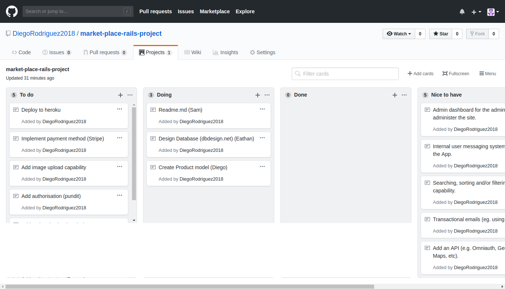
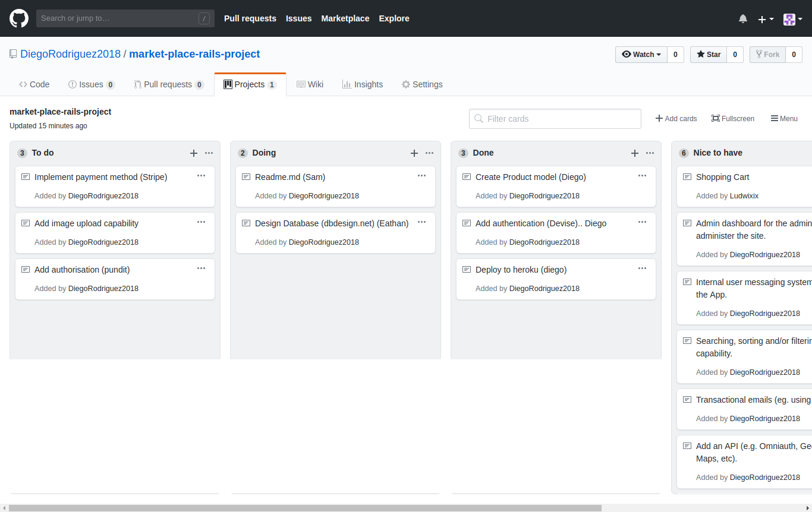
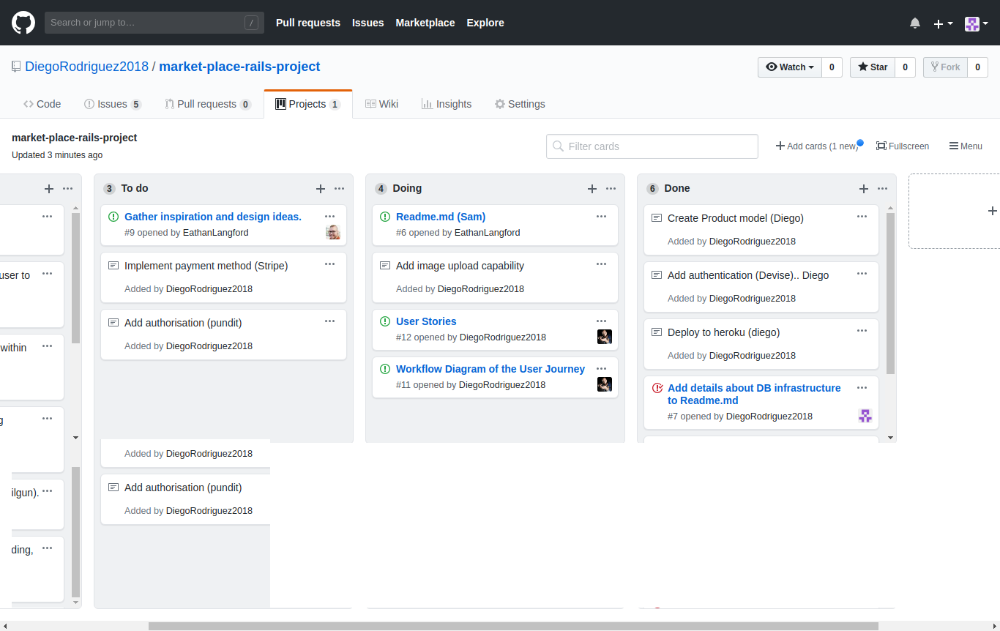
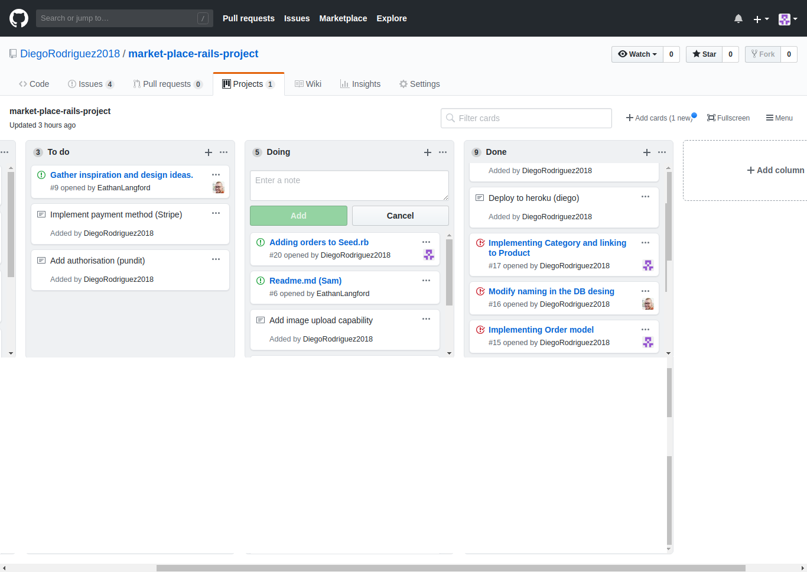
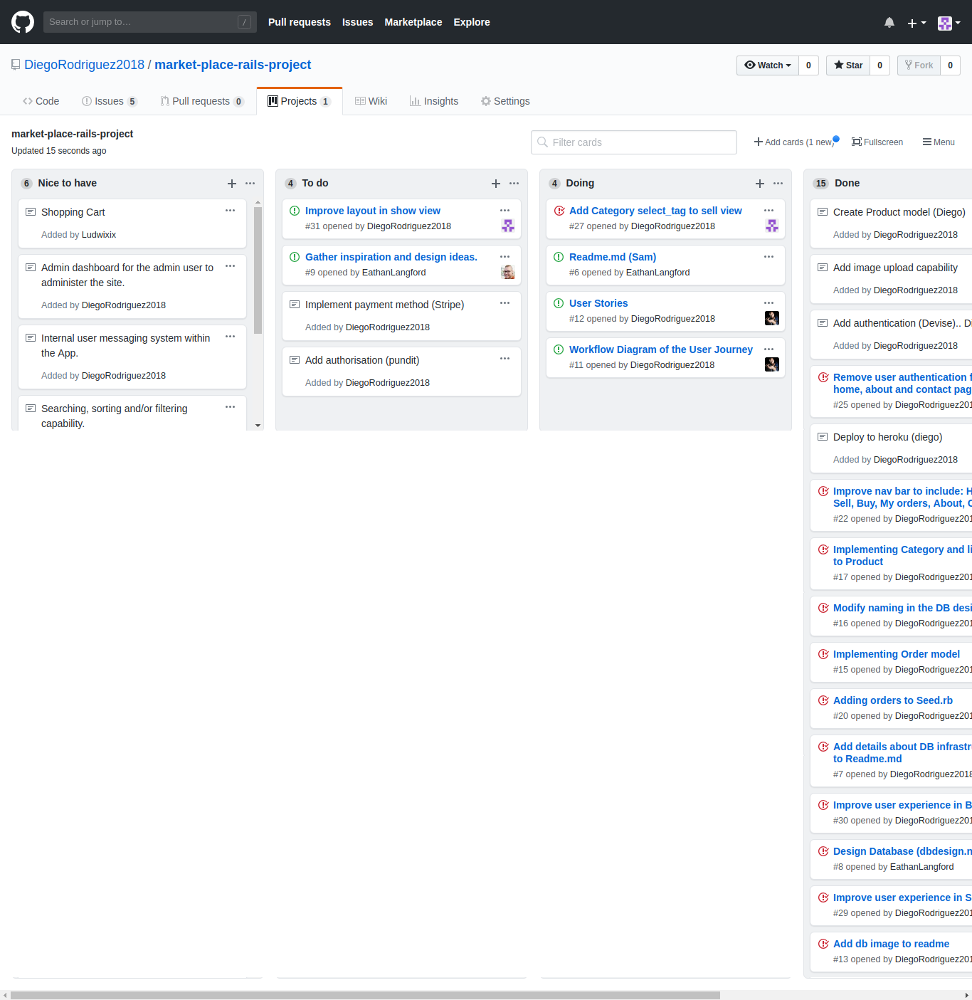
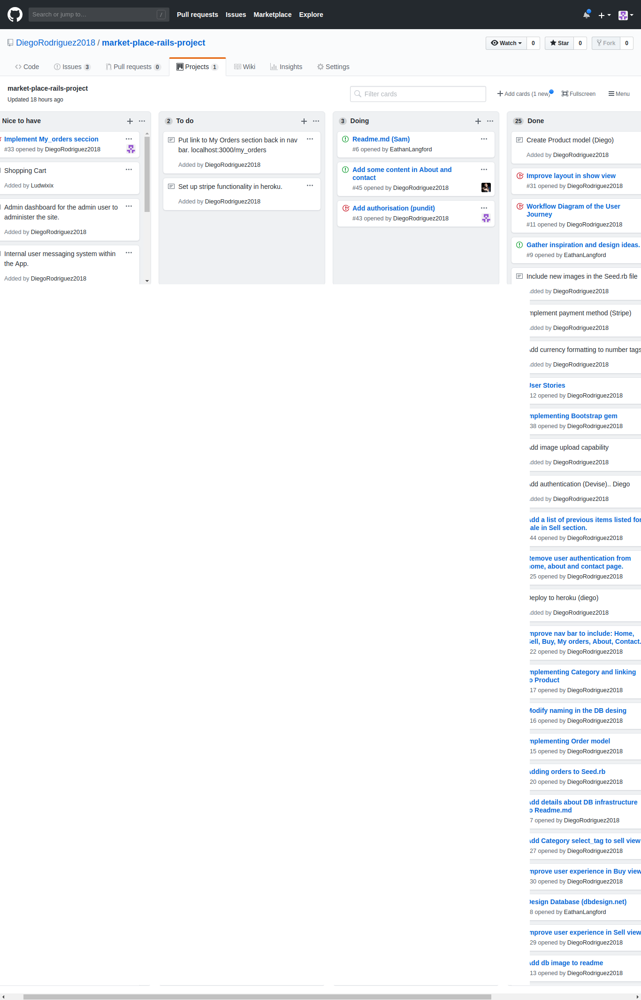

# README

## Website URL
https://camo-market.herokuapp.com/users/sign_in

### Github Repository
https://github.com/DiegoRodriguez2018/market-place-rails-project
___________________________________________________
## Project Description
```

Enter description

```

___________________________________________________
#####  Problems Encountered


* Local image seeding: One of the first problems we encountered is how to locally seed images with Active Storage. After getting familiar with the tool and reading some documentation we figure out we had to store it in a temporal variable and use the attach method in our seeds.rb file as shown below:
   ``` ruby
    (1..n).each do |i|
        temp = Product.create(
            title: "Image #{i}" ,
            price: 20 ,
            description: "Image number  #{i}" ,
            user: User.first
        )
        file = Rails.root.join('db','img',"#{i}.jpg")
        temp.image.attach(
            io: File.open(file),
            filename: "file.jpg"
        )  
    end
    ```
*After running `rails db:seed`, the files were successfully added to our database.*

* Heroku Image Seeding: The next challenge was to seed some images in the Heroku repository. The process was pretty much the same with the only difference we had to run Heroku run rails db:seed`


___________________________________________________
#####  Purpose
```

website purpose

```
___________________________________________________
#####   Functionality
```

website Functionality

```
___________________________________________________
#####  features
```

website features

```
___________________________________________________
#####  Screenshots
```

INSERT Screenshots

```
___________________________________________________
####  Tech Stack
```

(e.g. html, css, deployment platform, etc)

* HTML
* CSS
* Ruby on Rails
* Amazon Web Services
* Heroku
* Devise
* Pundit


```
___________________________________________________
####  Setup & Configuration Instructions
```

    Instructions on how to setup, configure and use your App.

```
___________________________________________________
## Design Documentation
```
Design process
Wireframes
```
___________________________________________________

###### User Stories and Workflow diagram:
* This is the UserStories and Workflow digram we created in figma.


___________________________________________________

###### Database Design:
* ERD: After discussing about our database structure we agreed to the following database structure:


* Infrastructure: As our Heroku app server is based in the US, we decided to base our AWS server in the US as well (us-east-1). As the servers are going to be located close to each other we hope the performance of our web app to be improved.

___________________________________________________
### Details of planning process:
```
including,
Project plan & timeline
Screenshots of Trello board(s)
```

 GitHub Projects Board 1
 Github Projects Board 2
 Github Projects Board 3
 Github Projects Board 4
 Github Projects Board 5
 Github Projects Board 6

___________________________________________________
# Answers to the 24 Questions


#### 1. What is the need (i.e. challenge) that you will be addressing in your project?

* To build a marketplace where users can buy, sell, trade camouflage patterns, clothing and related products.
* The website will also provide a database on various camouflage related history and patterns.

#### 2. Identify the problem you’re trying to solve by building this particular marketplace App? Why is it a problem that needs solving?

* Currently no purely camouflage orientated marketplace exists.

#### 3. Describe the project you will be conducting and how your App will address these needs.

* We will be building a two sided marketplace that offers a location for users to buy, sell and trade camouflage clothing and items. It will also provide users with information pertaining to all aspects of DPM.

#### 4. Describe the network infrastructure the App may be based on.
#### 5. Identify and describe the software to be used in your App.
#### 6. Identify the database to be used in your App and provide a justification for your choice.
#### 7. Identify and describe the production database setup (i.e. postgres instance).
#### 8. Describe the architecture of your App.
#### 9. Explain the different high-level components (abstractions) in your App.
#### 10. Detail any third party services that your App will use.
#### 11. Describe (in general terms) the data structure of marketplace apps that are similar to your own (e.g. eBay,   Airbnb).
#### 12. Discuss the database relations to be implemented.
#### 13. Describe your project’s models in terms of the relationships (active record associations) they have with each other.
#### 14. Provide your database schema design.
#### 15. Provide User stories for your App.
#### 16. Provide Wireframes for your App.
#### 17. Describe the way tasks are allocated and tracked in your project.
#### 18. Discuss how Agile methodology is being implemented in your project.
#### 19. Provide an overview and description of your Source control process.
#### 20. Provide an overview and description of your Testing process.
#### 21. Discuss and analyse requirements related to information system security.
#### 22. Discuss methods you will use to protect information and data.
#### 23. Research what your legal obligations are in relation to handling user data.

Authors:
Eathan Langford
Diego Rodriguez
Sam Ludwig
